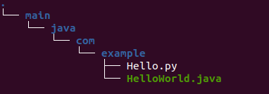
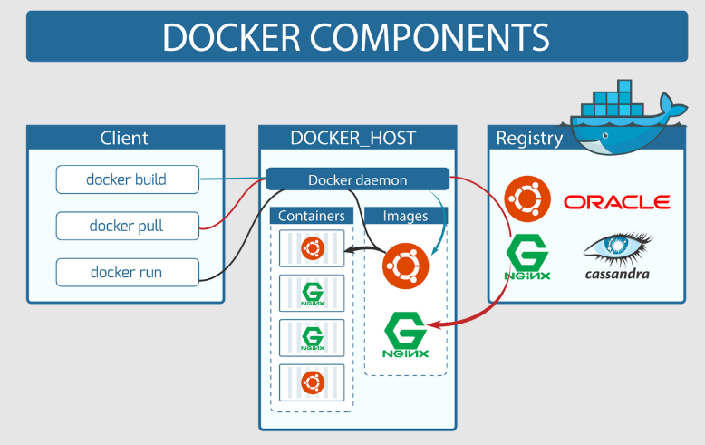
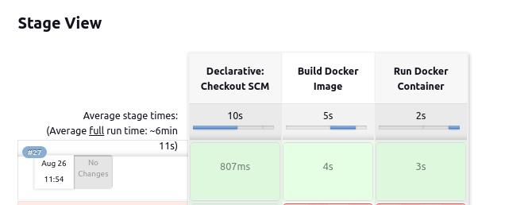

# Jenkins Pipeline for Java Application with Docker

## Title: Creating a Jenkins Pipeline for Java Code to Generate a JAR File

### Objective
The objective of this assignment is to create a Docker container for a Java application such that executing the container results in the generation of a `.jar` file. This JAR file can then be easily shared as the output of the build process.

---

## (A) Project Structure

The project should be structured as follows:

- **Java File**: The Java source file, `HelloWorld.java`, should be located in the directory `src/main/java/com/example`. Ensure that the file is saved in this specific directory and that the necessary folder structure is created.

- **POM File**: A `pom.xml` file must be created to specify all dependencies and their respective versions required for the Java application.

- **Dockerfile**: This file will utilize OpenJDK as the base image. The application will be set up in the working directory, and the `pom.xml` and source files will be copied into this directory. The Dockerfile will also contain instructions to run the Java application when the container starts.

  

---

## (B) Creating the Docker Container

### Docker Host and Docker Daemon

Docker facilitates the separation of applications from infrastructure, providing a platform to run containers efficiently. The relationship between the Docker host and the Docker daemon is akin to a client-server model; these components can reside on the same machine or be installed on different machines. The processes of creating Docker images and running containers are managed by the Docker daemon.

 

### Steps to Create a Docker Image

To create a Docker image using the Dockerfile, execute the following command:
```bash
docker build -t image_name .
```

You can view all Docker images on your system using the following commands:
```bash
docker images
```
or
```bash
docker image ls
```

### Steps to Create a Docker Container

To create and run a Docker container, use the command:
```bash
docker run -d -p host_port:container_port docker_image_name
```
The `-d` flag enables the container to run in detached mode; without this flag, the container will run in interactive mode.

To view running containers, use:
```bash
docker ps
```
To see all containers, including those that are stopped, use:
```bash
docker ps -a
```

### Accessing the Docker Container

To access the shell of a running Docker container, use the command:
```bash
docker exec -it container_name sh
```
This command opens a shell session inside the container, allowing you to view and modify files as necessary.

---

## (C) Creating the Jenkins Pipeline

Jenkins is an open-source tool designed to facilitate the creation of Continuous Integration and Continuous Deployment (CI/CD) pipelines. By establishing a pipeline, we can automate various tasks associated with the build and deployment processes.

### Steps to Create a Jenkins Pipeline

1. **Create a Jenkins Account**: After running the Docker container, create an account on Jenkins.

2. **Create a New Item**: Navigate to "New Item" in the Jenkins dashboard and provide a name for the pipeline, such as `docker-CICD`.

3. **Job Description**: Enter a relevant description for the job to clarify its purpose.

4. **GitHub Project URL**: In the "GitHub Project URL" field, provide the URL of your GitHub repository containing the Java application.

5. **Pipeline Section**:
   - **Definition**: Select "Pipeline script from SCM."
   - **Repository URL**: Enter the URL of your GitHub repository.
   - Ensure that you have established GitHub credentials before running the job.
   - **Branch**: Specify the branch where all content is saved.
   - **Script Path**: Enter `Jenkinsfile` (the name must match exactly as it appears in your GitHub repository).

6. **Save and Run Job**: Save the configuration and execute the job.

 

7. **Expected Outcome**: The end result should reflect a successful pipeline execution. If you encounter any issues, please review the instructions carefully and ensure that you are following the repository guidelines.

---

This documentation serves as a comprehensive guide for setting up a Jenkins pipeline for a Java application using Docker. It is intended to assist anyone navigating through the repository to understand the process and achieve the desired outcomes effectively.
